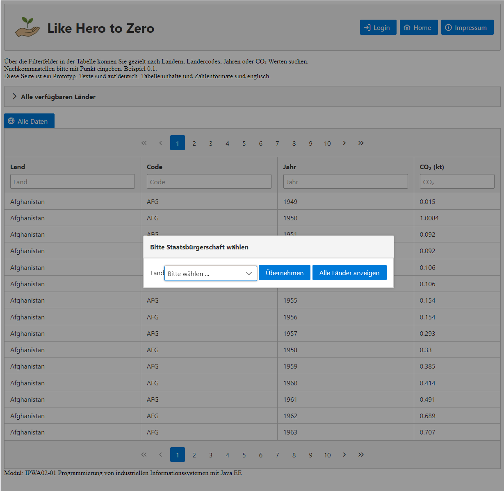
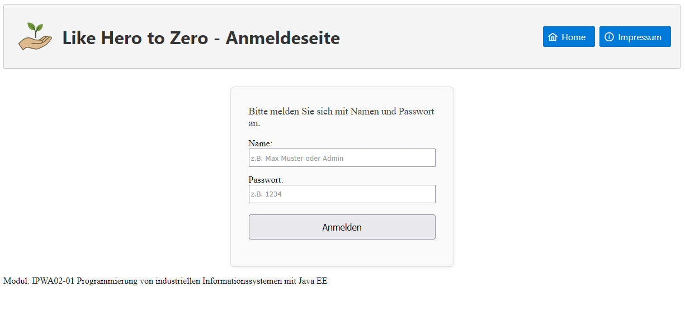
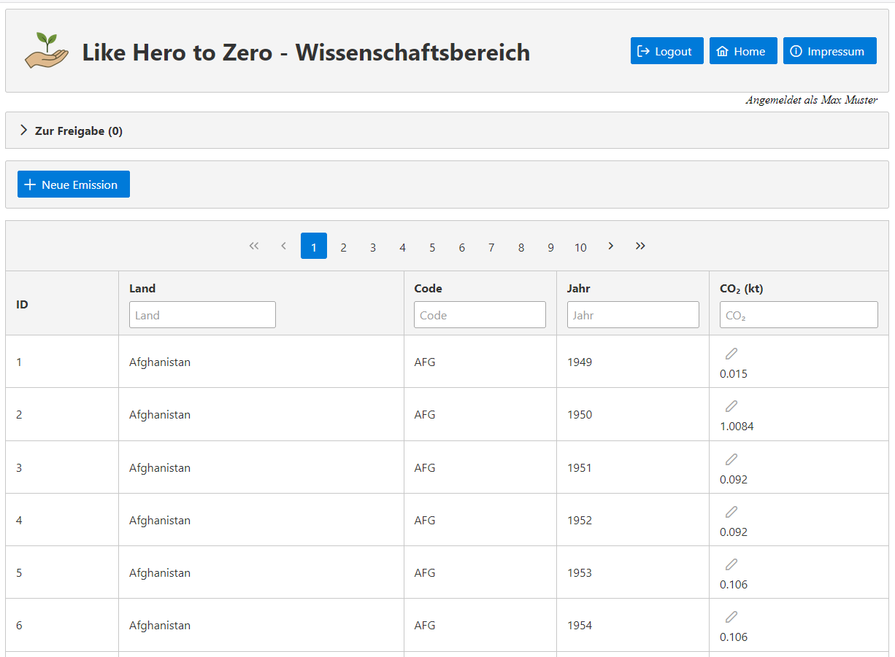
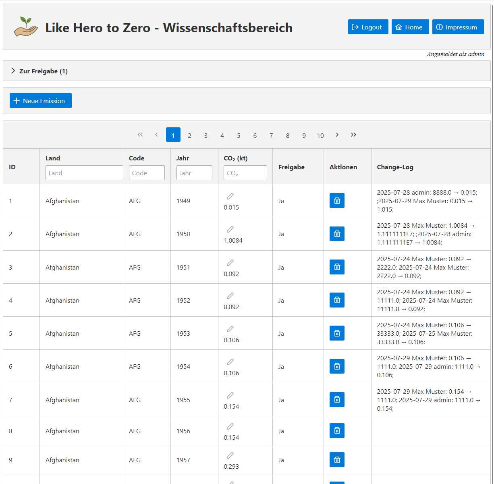
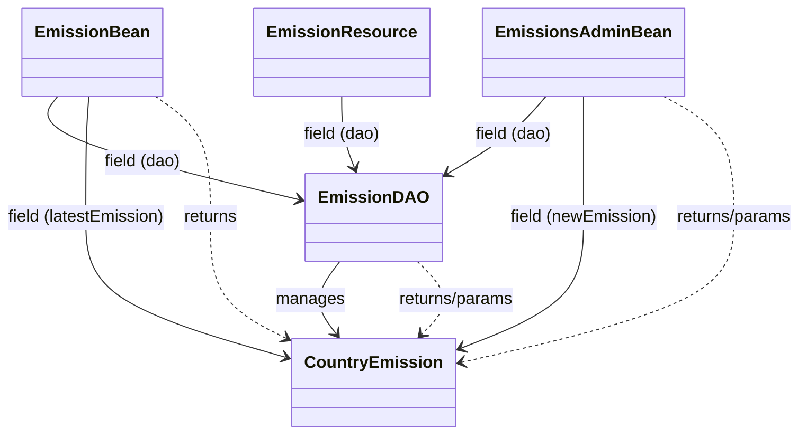
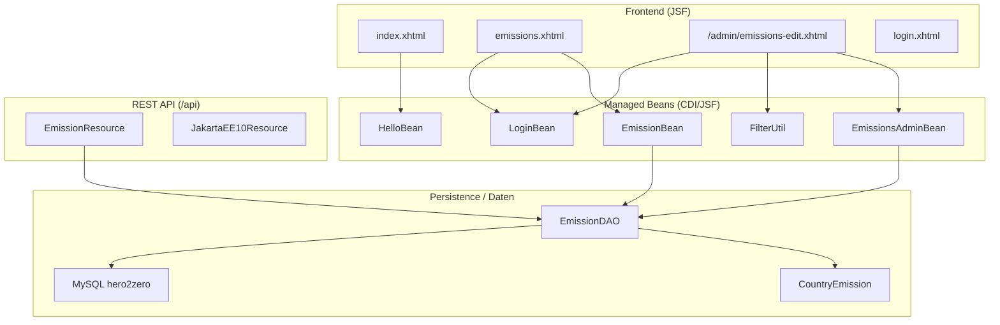
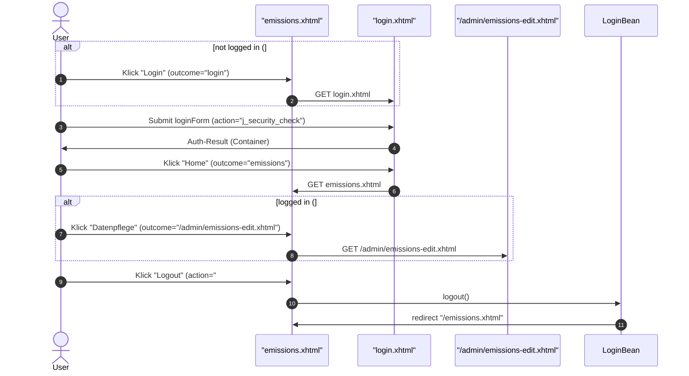
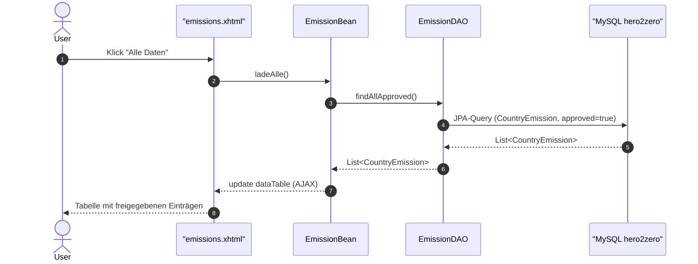
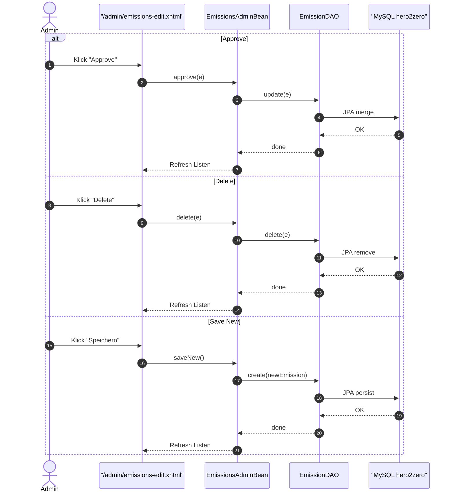

## Überblick
Hero2Zero – kleine Jakarta-EE-Anwendung (JSF + REST + JPA) zur Anzeige und Pflege von CO₂-Emissionsdaten.

## Tech-Stack
JDK 17, Payara 6 (Jakarta EE 10), JPA (MySQL), JSF (PrimeFaces).

## Screenshots (Umsetzung)
### Startseite – `emissions.xhtml`
Auswahl der Staatsbürgerschaft. Tabelle zeigt freigegebene CO₂-Einträge.

  

### Login – `login.xhtml`
Formularbasierter Login (Container-Security); Weiter zur `/admin/emissions-edit.xhtml` nach erfolgreicher Anmeldung.

  

### Datenpflege (Wissenschaftsbereich) – `/admin/emissions-edit.xhtml` als eingeloggter User
Änderung von CO²-Werten, anlegen neuer Datensätze; Filterfunktion für schnelle Eingrenzung.

  

### Datenpflege (Wissenschaftsbereich) – `/admin/emissions-edit.xhtml` eingeloggt als Rolle 'admin'
Ändern, neu anlegen, freigeben oder löschen von Datensätzen; Filterfunktion wie User

  

## Architektur – Klassen (Kurzüberblick)

## Architektur – Komponenten

*Legende:* `-->` nutzt/ruft an. EL-Bindings aus XHTML → Beans sind hier **absichtlich** sichtbar; reine Container-Entdeckungen (z. B. `@ApplicationPath`) erzeugen keine Kante.  
EmissionResource → EmissionDAO = methodischer Aufruf (z. B. DAO-Methoden). 
EmissionDAO → CountryEmission/DB = JPA-Entity bzw. Datenbankzugriff.

## Nutzerflüsse – Sequenzen

### Navigation (Login/Logout/Admin)

### „Alle Daten“ auf *emissions.xhtml*

### Admin-Aktionen auf */admin/emissions-edit.xhtml*

## Setup und Run (Dev)
- Payara 6 starten; Datasource **`jdbc/hero2zero`** anlegen.  
- `persistence.xml` (PU: **Hero2ZeroPU**) zeigt auf  
  `jdbc:mysql://127.0.0.1:3306/hero2zero`, User `h2zuser`, PW `h2zpass`.  
- WAR deployen; App-URL entsprechend deiner Umgebung aufrufen.

## REST-API
`GET /api/emissions` – liefert `List<CountryEmission>` (siehe `@ApplicationPath("api")` + `@Path("emissions")`).

## Hinweise / Qualität
- JSF-EL erzeugt keine Klassenpfeile → im Komponentendiagramm visualisiert.
- Dev-Credentials nur lokal; produktiv via Env/Secrets.
- Sprechende Namen, kleine Klassen, klare Verantwortungen.
- Optional: weitere Details in CONTRIBUTING.md / SECURITY.md.
 
