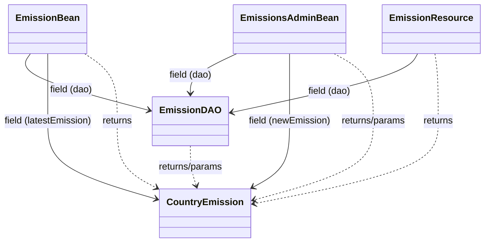
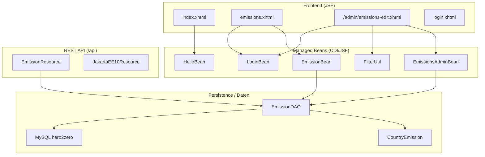
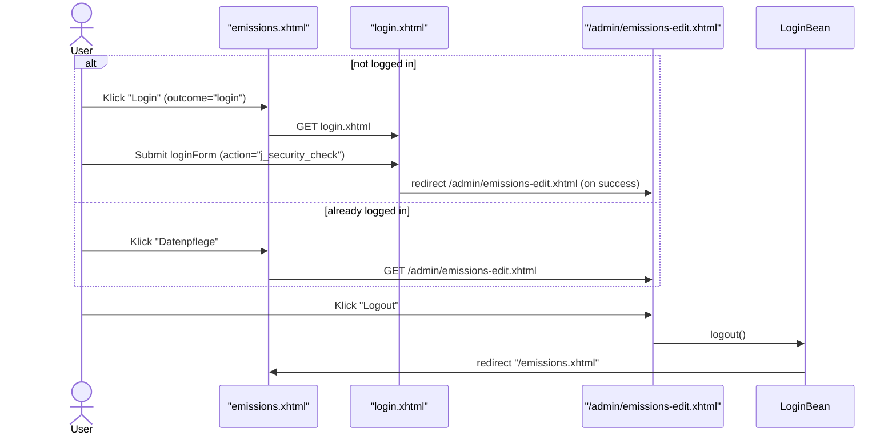
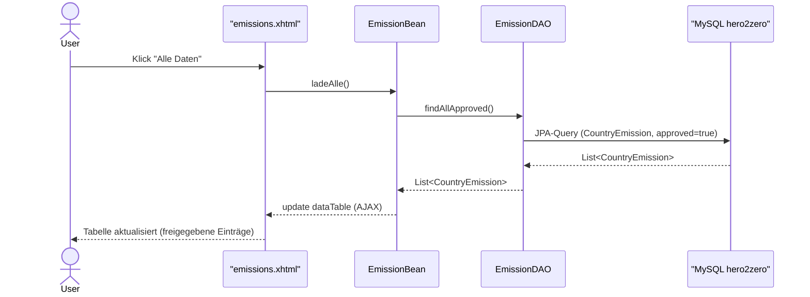
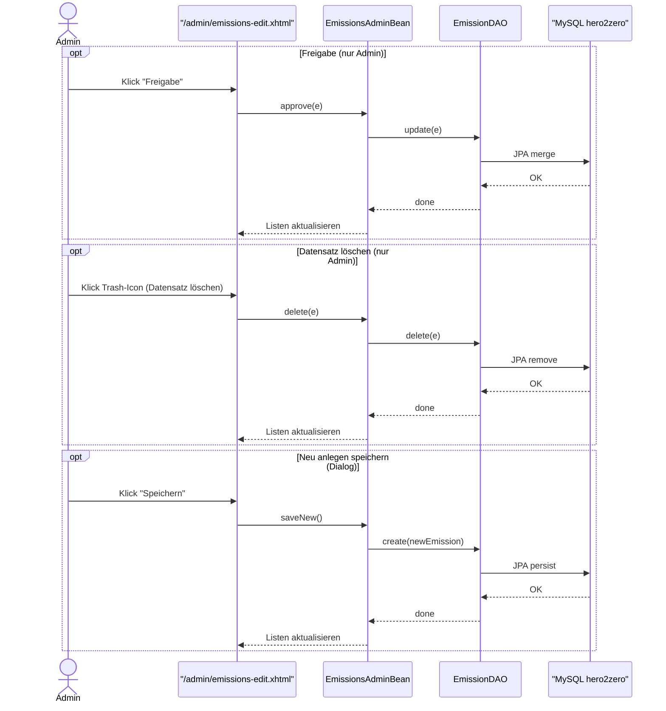

## Überblick
Like Hero To Zero ist eine Jakarta-EE-Anwendung (JSF + REST + JPA) zur Anzeige und Pflege von CO₂-Emissionsdaten. Als Datenquelle wurde unter https://ourworldindata.org/co2-and-greenhouse-gas-emissions der 'Download full data' genutzt (includes all enities an time points).<br>
Es gibt drei Nutzerzustände: nicht eingeloggt (öffentlich), eingeloggt ohne Admin-Rolle (Wissenschaftler*in*) und eingeloggt mit Admin-Rolle (Administrator*in*).<br>
Dies ist ein Studienprojekt ohne kommerziellen Hintergrund.

## Tech-Stack
JDK 17, Payara 6 (Jakarta EE 10), Jakarta REST (JAX-RS), JPA 3.0 (MySQL), JSF (PrimeFaces).

## Screenshots
### Startseite – `emissions.xhtml`
Auswahl des Landes (der Staatsbürgerschaft). Tabelle zeigt freigegebene CO₂-Einträge.
<p>
  
</p>

### Login – `login.xhtml`
Formularbasierter Login (Container-Security); nach erfolgreicher Anmeldung automatische Weiterleitung auf `/admin/emissions-edit.xhtml`.
<p>
  
</p>

### Datenpflege (Wissenschaftsbereich) – `/admin/emissions-edit.xhtml` als eingeloggter User
Änderung von CO₂-Werten, anlegen neuer Datensätze; Filterfunktion für schnelle Eingrenzung.
<p>
  
</p>

### Datenpflege (Wissenschaftsbereich) – `/admin/emissions-edit.xhtml` eingeloggt als Rolle 'admin'
Ändern, neu anlegen, freigeben oder löschen von Datensätzen; Filterfunktion wie User
<p>
  
</p>

## Architektur – Klassen (Kurzüberblick)


## Architektur – Komponenten

*Legende:* `-->` nutzt/ruft an. EL-Bindings aus XHTML → Beans sind hier **absichtlich** sichtbar; reine Container-Entdeckungen (z. B. `@ApplicationPath`) erzeugen keine Kante. <br>
EmissionResource → EmissionDAO = methodischer Aufruf (z. B. DAO-Methoden).<br>
EmissionDAO → CountryEmission/DB = JPA-Entity bzw. Datenbankzugriff.

## Nutzerflüsse – Sequenzen

### Navigation (Login/Logout/Admin)


### „Alle Daten“ auf *emissions.xhtml*


### Admin-Aktionen auf */admin/emissions-edit.xhtml*
Dieses Sequenzdiagramm zeigt die drei zustandsändernden Admin-Use-Cases (Freigabe, Löschen, Speichern). Pfad: JSF-Seite → EmissionsAdminBean → EmissionDAO → DB; danach Listenaktualisierung im UI. Zugriff ist auf die Rolle 'admin' beschränkt.



**Hinweis zur Persistenz:** In diesem Repo sind keine Zugangsdaten hinterlegt. 
Bitte `persistence.example.xml` nach `META-INF/persistence.xml` kopieren und die Platzhalter ausfüllen:

```xml
<property name="jakarta.persistence.jdbc.driver"   value="com.mysql.cj.jdbc.Driver"/>
<property name="jakarta.persistence.jdbc.url"      value="jdbc:mysql://127.0.0.1:3306/hero2zero"/>
<property name="jakarta.persistence.jdbc.user"     value="PUT_DBUSER_HERE"/>
<property name="jakarta.persistence.jdbc.password" value="PUT_DBPASSWORT_HERE"/>
```

## REST-API
`GET /api/emissions` – liefert `List<CountryEmission>` 

### Sicherheit
Echte DB-Zugangsdaten werden nicht im Repo gespeichert; `persistence.xml` ist lokal zu pflegen.

## Hinweise / Qualität
- JSF-EL erzeugt keine Klassenpfeile → im Komponentendiagramm visualisiert.
- Dev-Credentials nur lokal; produktiv via Env/Secrets.
- Sprechende Namen, kleine Klassen, klare Verantwortungen.
 
