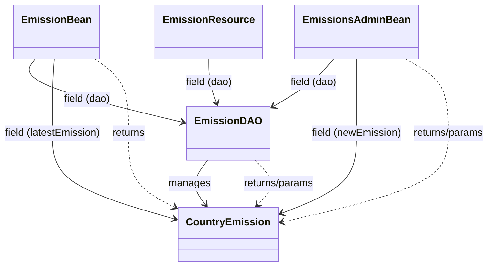
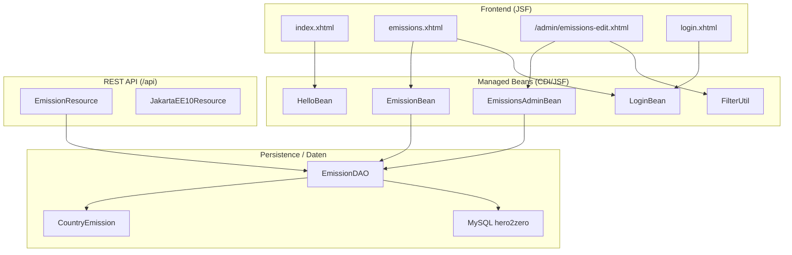
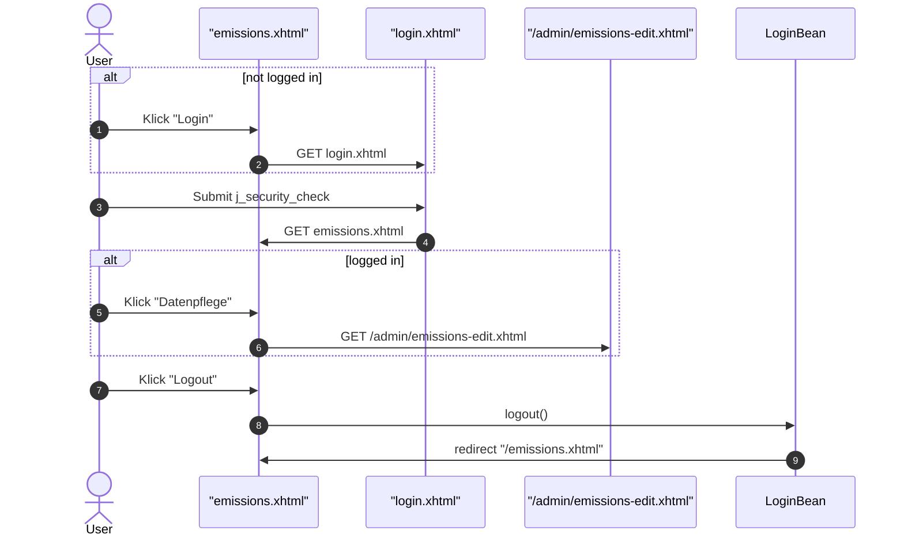
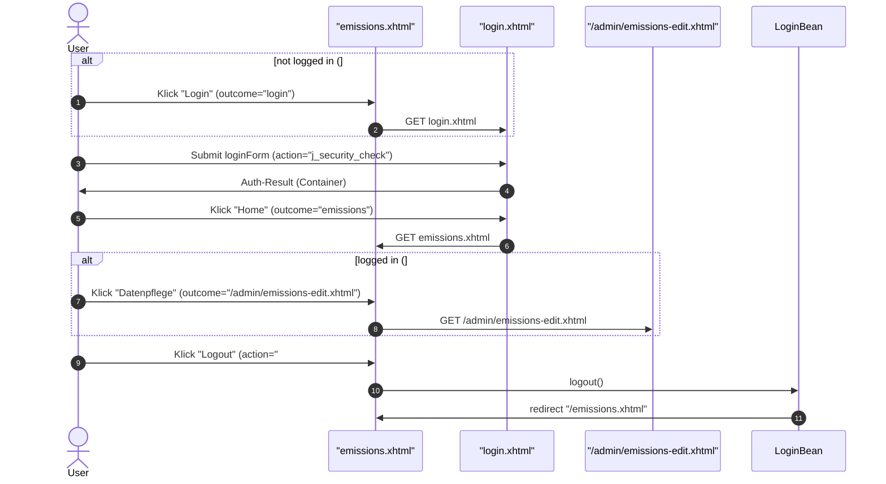
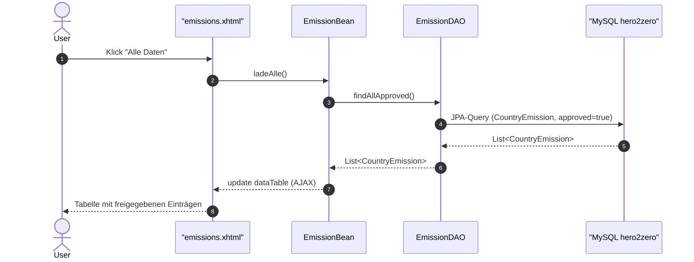
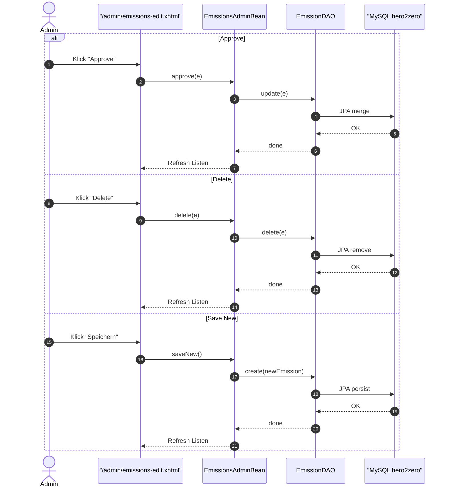

## Überblick
Hero2Zero – kleine Jakarta-EE-Anwendung (JSF + REST + JPA) zur Anzeige und Pflege von CO₂-Emissionsdaten.

## Tech-Stack
JDK 17, Payara 6 (Jakarta EE 10), JPA (MySQL), JSF (PrimeFaces).

## Architektur (Kurzüberblick – Klassen)

