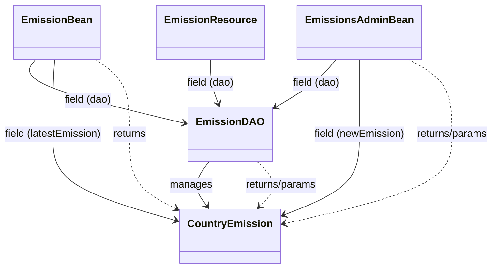
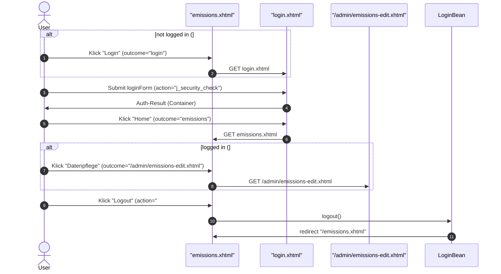
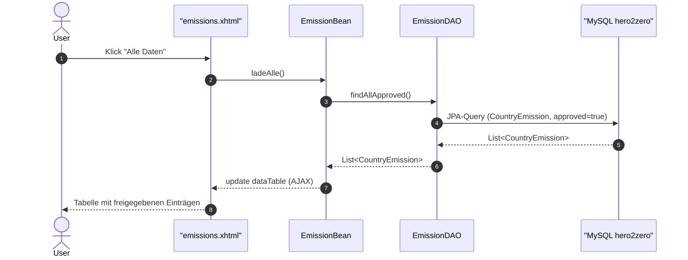
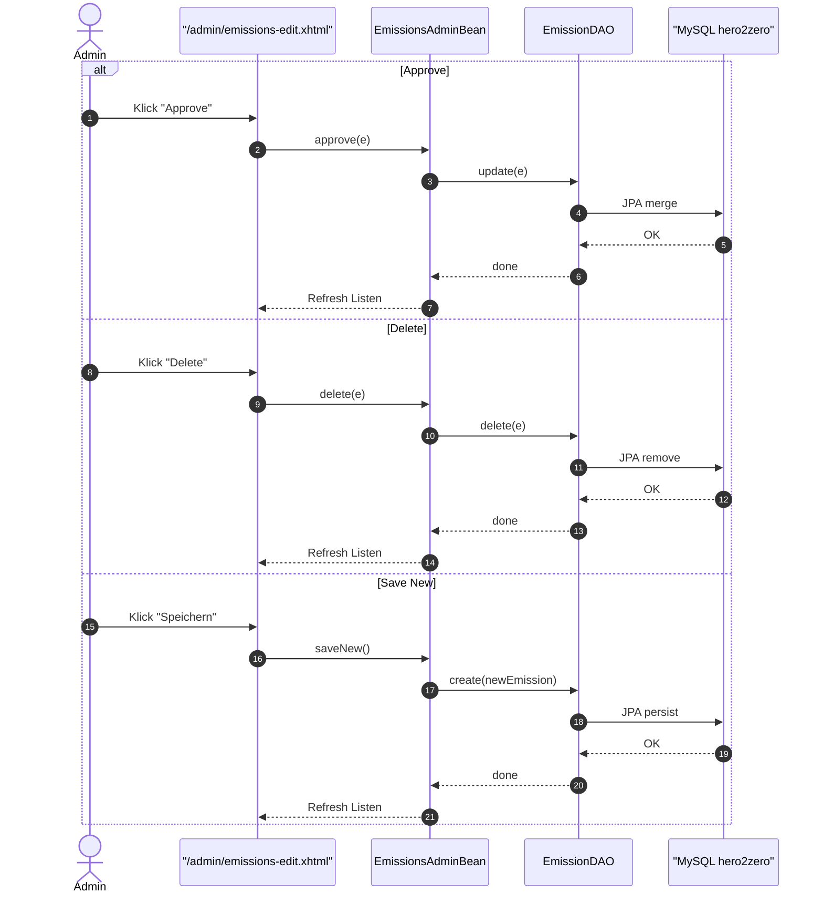

```mermaid
classDiagram
  %% Associations via fields
  EmissionBean --> EmissionDAO : field (dao)
  EmissionsAdminBean --> EmissionDAO : field (dao)
  EmissionResource --> EmissionDAO : field (dao)
  EmissionDAO --> CountryEmission : manages
  EmissionBean --> CountryEmission : field (latestEmission)
  EmissionsAdminBean --> CountryEmission : field (newEmission)

  %% Dependencies via method signatures
  EmissionDAO ..> CountryEmission : returns/params
  EmissionBean ..> CountryEmission : returns
  EmissionsAdminBean ..> CountryEmission : returns/params
```

```mermaid
sequenceDiagram
  autonumber
  actor User
  participant EmissionsPage as "emissions.xhtml"
  participant LoginPage as "login.xhtml"
  participant AdminPage as "/admin/emissions-edit.xhtml"
  participant LoginBean

  alt not logged in (#{loginBean.loggedIn} == false)
    User ->> EmissionsPage: Klick "Login" (outcome="login")
    EmissionsPage ->> LoginPage: GET login.xhtml
  end

  User ->> LoginPage: Submit loginForm (action="j_security_check")
  LoginPage ->> User: Auth-Result (Container)
  User ->> LoginPage: Klick "Home" (outcome="emissions")
  LoginPage ->> EmissionsPage: GET emissions.xhtml

  alt logged in (#{loginBean.loggedIn} == true)
    User ->> EmissionsPage: Klick "Datenpflege" (outcome="/admin/emissions-edit.xhtml")
    EmissionsPage ->> AdminPage: GET /admin/emissions-edit.xhtml
  end

  User ->> EmissionsPage: Klick "Logout" (action="#{loginBean.logout()}")
  EmissionsPage ->> LoginBean: logout()
  LoginBean ->> EmissionsPage: redirect "/emissions.xhtml"

```

```mermaid
sequenceDiagram
  autonumber
  actor User
  participant EmissionsPage as "emissions.xhtml"
  participant EmissionBean
  participant EmissionDAO
  participant DB as "MySQL hero2zero"

  User ->> EmissionsPage: Klick "Alle Daten"
  EmissionsPage ->> EmissionBean: ladeAlle()
  EmissionBean ->> EmissionDAO: findAllApproved()
  EmissionDAO ->> DB: JPA-Query (CountryEmission, approved=true)
  DB -->> EmissionDAO: List<CountryEmission>
  EmissionDAO -->> EmissionBean: List<CountryEmission>
  EmissionBean -->> EmissionsPage: update dataTable (AJAX)
  EmissionsPage -->> User: Tabelle mit freigegebenen Einträgen
```

```mermaid
sequenceDiagram
  autonumber
  actor Admin
  participant AdminPage as "/admin/emissions-edit.xhtml"
  participant EmissionsAdminBean
  participant EmissionDAO
  participant DB as "MySQL hero2zero"

  alt Approve
    Admin ->> AdminPage: Klick "Approve"
    AdminPage ->> EmissionsAdminBean: approve(e)
    EmissionsAdminBean ->> EmissionDAO: update(e)
    EmissionDAO ->> DB: JPA merge
    DB -->> EmissionDAO: OK
    EmissionDAO -->> EmissionsAdminBean: done
    EmissionsAdminBean -->> AdminPage: Refresh Listen
  else Delete
    Admin ->> AdminPage: Klick "Delete"
    AdminPage ->> EmissionsAdminBean: delete(e)
    EmissionsAdminBean ->> EmissionDAO: delete(e)
    EmissionDAO ->> DB: JPA remove
    DB -->> EmissionDAO: OK
    EmissionDAO -->> EmissionsAdminBean: done
    EmissionsAdminBean -->> AdminPage: Refresh Listen
  else Save New
    Admin ->> AdminPage: Klick "Speichern"
    AdminPage ->> EmissionsAdminBean: saveNew()
    EmissionsAdminBean ->> EmissionDAO: create(newEmission)
    EmissionDAO ->> DB: JPA persist
    DB -->> EmissionDAO: OK
    EmissionDAO -->> EmissionsAdminBean: done
    EmissionsAdminBean -->> AdminPage: Refresh Listen
  end

```
